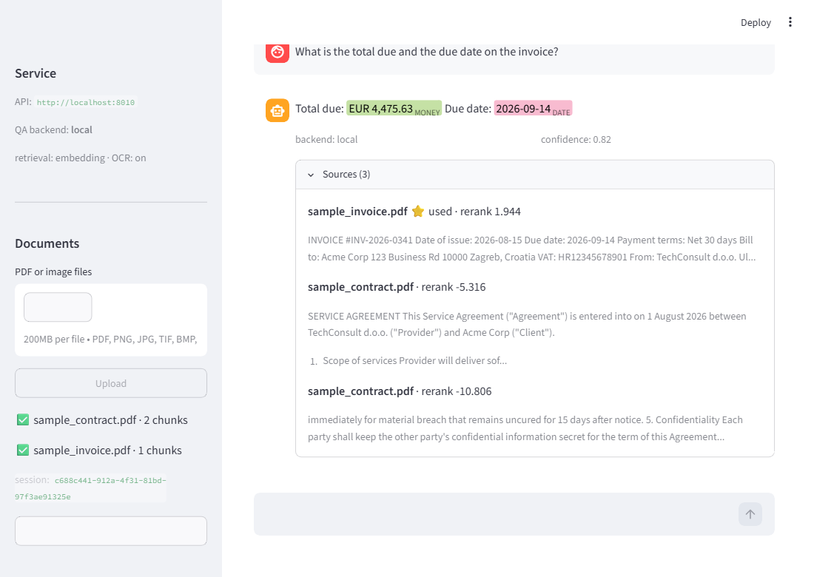
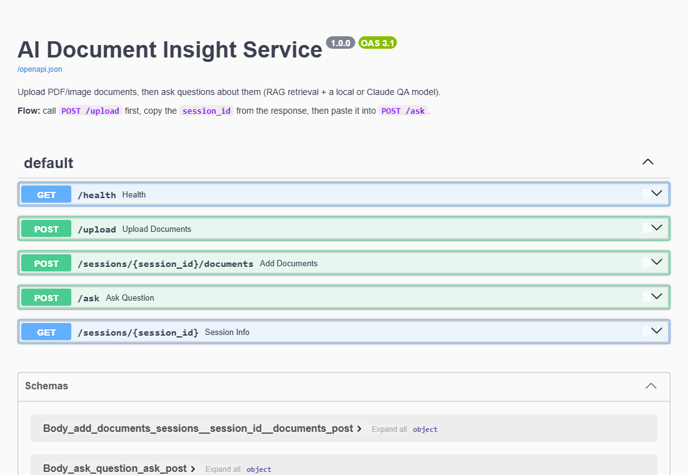

# AI Document Insight Service

A Python REST API (FastAPI) that ingests **PDF or image** documents (scanned
contracts, invoices, receipts…), extracts their text, and answers natural-language
questions about them using **Retrieval-Augmented Generation**.

The whole stack is **torch-free** – it installs and runs on any modern Python
(3.11 – 3.14), CPU only, and the default question-answering model is **local and
free** (no API key, no payment). Anthropic **Claude** is an optional drop-in
backend for higher-quality answers.

---

## Contents

- [Features](#features)
- [Architecture](#architecture)
- [Quick start (Docker)](#quick-start-docker)
- [Demo UI](#demo-ui)
- [Manual installation](#manual-installation)
- [Configuration](#configuration)
- [API reference & examples](#api-reference--examples)
- [Evaluation](#evaluation)
- [Test documents](#test-documents)
- [Running the tests](#running-the-tests)
- [Approach & design choices](#approach--design-choices)
- [Limitations & next steps](#limitations--next-steps)

---

## Features

| Requirement | Status |
|---|---|
| `POST /upload` – one or more documents, session-based retrieval | ✅ |
| `POST /sessions/{id}/documents` – add documents to a session | ✅ |
| `POST /ask` – QA pipeline over stored documents | ✅ |
| Dockerized | ✅ (`Dockerfile` + `docker-compose.yml`) |
| Dummy test documents in the repo | ✅ (`test_docs/`) |
| Text extraction: PyMuPDF (digital PDFs) **+ Tesseract OCR** (images / scanned PDFs) | ✅ |
| Three QA backends: local sentence-ranking (default), local DistilBERT-SQuAD, or Claude | ✅ |
| Answers cite the source excerpts they used | ✅ |
| **Core enhancement 1: RAG** – FAISS embeddings + cross-encoder reranking | ✅ |
| **Core enhancement 2: NER** – entities highlighted in every answer | ✅ |
| **Core enhancement 3: caching** – LRU answer cache (Redis-swappable) | ✅ |
| **General enhancement: Streamlit demo UI** (`ui.py`) with entity highlighting | ✅ |
| **General enhancement: eval harness** (`scripts/eval.py`) + CI | ✅ |
| Structured logging, health check, env-based config | ✅ |

---

## Architecture

```
   PDF / image ─▶ extraction ─▶ normalize ─▶ chunk ─▶ embed ─▶ FAISS index
                  (PyMuPDF /     (join soft   (900c /   (fastembed  (per session_id,
                   Tesseract)     wraps)       150 ovl)  bge-small)  in-memory)
                                                                          │
   question ─▶ answer cache (LRU) ──hit──▶ cached answer                   │
       │ miss                                                             ▼
       │   1. FAISS: top-12 candidate chunks (cosine)
       │   2. cross-encoder rerank (ms-marco-MiniLM) → top-6 chunks
       ▼
   qa_engine (dispatch on QA_BACKEND)
     ├─ local       → rank sentences of the top chunks with the cross-encoder
     ├─ distilbert  → DistilBERT-SQuAD span extraction (onnxruntime)
     └─ claude      → Claude API, chunks as context
       │
       ▼  NER pass (bert-base-NER + regex) tags entities in the answer
          → { answer, confidence, entities[], sources[], cached }
```

`RETRIEVAL_MODE=full` skips embeddings/FAISS/rerank and passes every chunk to the
QA backend.

---

## Quick start (Docker)

No API key needed – the default backend is the local model.

```bash
docker compose up --build
```

First build downloads the embedding + reranker models (~180 MB) and bakes them
into the image, so the running container needs no network. `docker compose` starts
two services:

| URL | What |
|---|---|
| <http://localhost:8501> | **Streamlit demo UI** – upload + ask, point-and-click |
| <http://localhost:8000/docs> | API + Swagger UI |

```bash
curl -s localhost:8000/health | jq
```

To use Claude instead:

```bash
QA_BACKEND=claude ANTHROPIC_API_KEY=sk-ant-xxxx docker compose up --build
```

Plain `docker`:

```bash
docker build -t doc-insight .
docker run -p 8000:8000 doc-insight                       # local model
docker run -p 8000:8000 -e QA_BACKEND=claude -e ANTHROPIC_API_KEY=sk-ant-xxx doc-insight
```

---

## Demo UI

A small [Streamlit](https://streamlit.io) app (`ui.py`) that drives the API from a
browser – file uploader in the sidebar, a chat box for questions, and answers with
**entities highlighted inline** (money, dates, people, orgs, places) plus an
expandable list of source excerpts (the used one starred, with rerank scores).
It's a plain HTTP client: no ML dependencies, it just calls `/upload` and `/ask`.



With Docker it's already running at <http://localhost:8501>. Standalone:

```bash
pip install -r requirements-ui.txt
uvicorn app.main:app --port 8000        # API in one terminal
API_URL=http://localhost:8000 streamlit run ui.py   # UI in another
```

Set `DEMO_DOCS=test_docs/sample_contract.pdf,test_docs/sample_invoice.pdf` to
auto-load documents on startup.

---

## Manual installation

Works on Python 3.11 – 3.14.

```bash
python -m venv venv
source venv/bin/activate            # Windows: venv\Scripts\activate

pip install -r requirements.txt
uvicorn app.main:app --reload
```

That's it – `POST /upload` and `POST /ask` work immediately with the local
backend. The embedding and reranker models download automatically on first use
(cached under `~/.cache/huggingface` and a fastembed cache dir).

**OCR** (image uploads / scanned PDFs) additionally needs the Tesseract binary:

| OS | Install |
|---|---|
| Debian/Ubuntu | `sudo apt-get install tesseract-ocr` |
| macOS | `brew install tesseract` |
| Windows | [UB-Mannheim installer](https://github.com/UB-Mannheim/tesseract/wiki), then add it to `PATH` |

Without Tesseract, digital-PDF Q&A still works; set `OCR_ENABLED=false` to silence
image-upload errors.

**Claude backend** (optional): put a key in `.env` and set the backend:

```bash
cp .env.example .env      # edit ANTHROPIC_API_KEY
echo "QA_BACKEND=claude" >> .env
```

---

## Configuration

All settings are environment variables (or lines in `.env`). See `.env.example`.
Nothing is required.

| Variable | Default | Notes |
|---|---|---|
| `QA_BACKEND` | `local` | `local` (sentence ranking), `distilbert` (span extraction), or `claude`. |
| `ANTHROPIC_API_KEY` | – | Required only when `QA_BACKEND=claude`. |
| `LLM_MODEL` | `claude-haiku-4-5` | Claude model id. |
| `RETRIEVAL_MODE` | `embedding` | `embedding` or `full`. |
| `EMBEDDING_MODEL` | `BAAI/bge-small-en-v1.5` | fastembed-supported model. |
| `RERANK_ENABLED` | `true` | Cross-encoder reranking of FAISS candidates. |
| `RERANK_MODEL` | `Xenova/ms-marco-MiniLM-L-6-v2` | fastembed cross-encoder. |
| `RERANK_CANDIDATES` | `12` | FAISS pool size before reranking. |
| `CHUNK_SIZE` / `CHUNK_OVERLAP` | `900` / `150` | Characters. |
| `TOP_K` | `6` | Chunks passed to the QA backend after reranking. |
| `NER_ENABLED` | `true` | Highlight entities in answers. |
| `NER_MODEL` | `Xenova/bert-base-NER` | ONNX token-classifier for PER/ORG/LOC. |
| `CACHE_ENABLED` / `CACHE_SIZE` | `true` / `256` | LRU answer cache. |
| `OCR_ENABLED` | `true` | Tesseract for images and scanned PDFs. |
| `OCR_LANGUAGES` | `eng` | Tesseract codes, e.g. `eng+hrv`. |
| `MAX_UPLOAD_MB` | `25` | Per-file limit. |
| `QA_LOCAL_MODEL` | `Xenova/distilbert-base-cased-distilled-squad` | ONNX SQuAD model for the `distilbert` backend. |

---

## API reference & examples

Base URL: `http://localhost:8000` · interactive docs at `/docs`:



### `GET /health`

```bash
curl -s localhost:8000/health
```
```json
{
  "status": "ok",
  "qa_backend": "local",
  "retrieval_mode": "embedding",
  "rerank_enabled": true,
  "ner_enabled": true,
  "ocr_enabled": true,
  "claude_key_configured": false,
  "cache": { "entries": 3, "capacity": 256 }
}
```

### `POST /upload`  · `multipart/form-data`

Uploads documents and creates a **new** session. Field `files` – one or more
`.pdf`, `.png`, `.jpg`, `.jpeg`, `.tif`, `.tiff`, `.bmp`, `.webp`.

```bash
curl -s -X POST localhost:8000/upload \
  -F "files=@test_docs/sample_invoice.pdf" \
  -F "files=@test_docs/sample_contract.pdf"
```
```json
{
  "session_id": "9fabd9fe-540f-47b1-84fc-f39040e5f782",
  "files": [
    { "filename": "sample_invoice.pdf",  "chars": 717,  "chunks": 1, "status": "ok" },
    { "filename": "sample_contract.pdf", "chars": 1394, "chunks": 2, "status": "ok" }
  ]
}
```

Unsupported/unreadable files are reported per-file; if *nothing* processed → `422`.

### `POST /sessions/{session_id}/documents`  · `multipart/form-data`

Adds more documents to an existing session (same `files` field). `404` if the
session doesn't exist.

### `POST /ask`  · `multipart/form-data`

| Field | Type |
|---|---|
| `session_id` | string (required) |
| `question` | string (required) |

**Local backend (default – sentence ranking):**
```bash
curl -s -X POST localhost:8000/ask \
  -F "session_id=9fabd9fe-540f-47b1-84fc-f39040e5f782" \
  -F "question=How much notice is required to terminate for convenience?"
```
```json
{
  "session_id": "9fabd9fe-540f-47b1-84fc-f39040e5f782",
  "question": "How much notice is required to terminate for convenience?",
  "backend": "local",
  "cached": false,
  "answer": "Termination Either party may terminate this Agreement for convenience with 30 days' prior written notice.",
  "confidence": 0.999,
  "entities": [
    { "text": "30 days", "label": "DATE", "start": 66, "end": 73 }
  ],
  "sources": [
    {
      "filename": "sample_contract.pdf",
      "snippet": "Termination Either party may terminate this Agreement ...",
      "used": true,
      "score": 0.79,
      "rerank_score": 7.7
    }
  ]
}
```

`answer` is the highest-scoring verbatim sentence(s) from the retrieved chunks;
`confidence` is the sigmoid of the cross-encoder score; `entities` are character
spans for highlighting (PERSON/ORG/LOCATION from the model, MONEY/DATE/PERCENT/
EMAIL/IBAN from regex); `used: true` marks the chunk the answer came from;
`cached: true` means the answer was served from the LRU cache.

**Claude backend** rephrases / synthesises and omits `confidence`:
```json
{
  "backend": "claude",
  "answer": "Either party can terminate for convenience by giving 30 days' written notice.",
  "sources": [ { "filename": "sample_contract.pdf", "snippet": "...", "score": 0.79 } ]
}
```

If `QA_BACKEND=claude` and no key is set, `/ask` returns `503`.

### `GET /sessions/{session_id}`

```json
{
  "session_id": "9fabd9fe-...",
  "documents": [ { "filename": "sample_invoice.pdf", "chars": 717, "chunks": 1 } ],
  "total_chunks": 3,
  "retrieval_mode": "embedding"
}
```

---

## Evaluation

`scripts/eval.py` runs a fixed 14-question set (with expected-substring answers,
including one deliberately-absent question) through the full pipeline and prints
an accuracy table. No server needed.

```bash
python scripts/eval.py                 # local + distilbert
python scripts/eval.py local claude    # needs ANTHROPIC_API_KEY
```

Current results on `test_docs/`:

| Backend | Score | Notes |
|---|---|---|
| `local` (sentence ranking) | **12 / 14** | misses only genuinely ambiguous cross-document questions ("issue date" vs "due date"; "total" when an invoice *and* a receipt are loaded) |
| `distilbert` (span extraction) | 5 / 14 | span extraction is fragile on a small model |
| `claude` | (run it with a key) | handles the ambiguous cases |

---

## Test documents

`test_docs/` contains fictional dummy documents and a generator script – see
[`test_docs/README.md`](test_docs/README.md). Regenerate:

```bash
python test_docs/generate_test_docs.py
```

---

## Running the tests

```bash
pip install -r requirements-dev.txt
pytest
```

The default suite (21 tests) runs in `RETRIEVAL_MODE=full` with the Claude call
mocked – **no model download, no API key, no network** – and covers every
endpoint, the cache (hit + invalidation), extraction, normalisation and chunking.
Four more tests download and run the real models (embedding retrieval, reranking,
NER, both local QA backends):

```bash
RUN_MODEL_TESTS=1 pytest tests/test_models.py
```

CI (`.github/workflows/ci.yml`) runs `pytest` and a `docker build` on every push.

---

## Approach & design choices

**Framework – FastAPI.** Async uploads, request validation, and free
OpenAPI/Swagger docs at `/docs` for a reviewer to try the API by hand.

**Torch-free by design.** The obvious libraries here (sentence-transformers,
EasyOCR, HF `transformers`) all pull in PyTorch – a large dependency with no
wheels for the newest Python releases and a fragile Docker story. Every ML piece
runs on **ONNX Runtime** instead:

- **Embeddings – `fastembed`** with `BAAI/bge-small-en-v1.5`.
- **Reranking – `fastembed` cross-encoder** `ms-marco-MiniLM-L-6-v2`.
- **NER – `bert-base-NER`** on ONNX Runtime.
- **OCR – Tesseract via `pytesseract`** (a small C++ binary, not a framework).
- **Optional `distilbert` backend – DistilBERT-SQuAD** run directly on ONNX
  Runtime (`app/qa_local.py`).

Result: one `requirements.txt`, `pip install` works everywhere (Python 3.11–3.14),
the Docker image is a plain `python:3.12-slim` + `apt-get tesseract-ocr`.

**Text extraction – PyMuPDF first, OCR fallback.** Most real contracts/invoices
are digital PDFs with a text layer; PyMuPDF reads it directly. When a PDF page has
(almost) no text layer we rasterise it and run Tesseract; image uploads always go
through Tesseract. Extracted text is then **normalised** (`normalize_text`) –
PDF/OCR output wraps sentences mid-line and indents every line, which badly
confuses downstream ranking. Soft wraps (line ends mid-sentence, next line
lowercase) are joined; hard breaks (each invoice field on its own line) are kept.

**Retrieval – RAG with embeddings + FAISS + a reranker.** Documents are split into
overlapping ~900-char chunks, embedded, and indexed in a FAISS `IndexFlatIP`
(cosine). At question time: FAISS pulls the top-12 candidates (fast but
approximate), then a **cross-encoder reranks** them – it scores the question and
each chunk *together* rather than as separate vectors, which is far better at
"does this chunk actually answer the question" and is what stops answers coming
from the wrong document. The top-6 reranked chunks go to the QA backend.

**Three QA backends** (`app/qa_engine.py` dispatches; all return the same shape):

| `QA_BACKEND` | How | Cost | Answer |
|---|---|---|---|
| `local` *(default)* | split the top chunks into sentences, rank them against the question with the cross-encoder, return the best 1–2 | free, offline | a verbatim sentence from the document |
| `distilbert` | DistilBERT-SQuAD span extraction on the top chunks | free, offline | a short extracted span |
| `claude` | `claude-haiku-4-5`, reranked chunks as context | API key, ~cents | a rephrased / synthesised sentence |

On the `scripts/eval.py` set the default `local` backend answers **12/14** – sentence
ranking turned out much more robust than span extraction for a small model
(`distilbert` 5/14), because it reuses the already-loaded cross-encoder, and a
low-confidence answer that isn't clearly separated from the runner-up becomes an
explicit "the documents don't contain a clear answer" instead of a confident
guess. `claude` handles the ambiguous cases.

**NER – model + regex.** `Xenova/bert-base-NER` (CoNLL-2003) on ONNX Runtime
covers PERSON / ORG / LOCATION; it has no MONEY/DATE labels, which matter most for
contracts and invoices, so regex patterns add MONEY / DATE / PERCENT / EMAIL /
IBAN. `extract_entities` returns character spans so the UI highlights them in
place; regex hits win on overlap. NER never fails a request – on any error it
returns the regex hits (or nothing).

**Caching.** `/ask` runs a cross-encoder over a dozen chunks (and, on the Claude
backend, a paid call), so repeated questions – common in a UI or demo – hit an
in-process LRU cache keyed by `(session_id, normalised question, backend)`.
Adding documents to a session invalidates its entries. `app/cache.py`'s
`get` / `put` / `invalidate` is a drop-in seam for Redis.

**Storage – in-memory, session-scoped.** A `session_id` (UUID) maps to its
documents and its FAISS index. Deliberately minimal; `storage.py`'s interface
(`create` / `add` / `get` / `search`) is what you'd keep when swapping in Redis
or a persistent vector DB.

**Ops.** 12-factor config, structured logging to stdout, `/health` reports
effective config, `scripts/eval.py` for regression-checking answer quality, the
Docker image pre-downloads models and has a `HEALTHCHECK`.

### How AI-generated code was validated

Parts were drafted with an LLM. Validation: (1) 21 automated tests cover
extraction against real generated PDFs, text normalisation, chunking, the cache,
and every endpoint including error paths; (2) `RUN_MODEL_TESTS=1` tests assert the
embedding index ranks the relevant chunk first, NER span offsets are exact, and
both local QA backends return the right answer; (3) `scripts/eval.py` scores the
whole pipeline per backend on a fixed question set (the 12/14 figure above) and
doubles as a regression check; (4) the ONNX span-extraction and NER BIO-decoding
maths (context-only tokens, offset mapping) was checked by hand; (5) the Anthropic
call follows current SDK docs (content-block iteration, typed errors).

---

## Limitations & next steps

- **Local QA is extractive** – both local backends return text that is *in* the
  document; they can't rephrase or combine facts across sentences, and on
  genuinely ambiguous questions ("issue date" vs "due date" when both are present)
  they can pick the wrong one. `QA_BACKEND=claude` handles those.
- **In-memory storage & cache** – both are lost on restart and not shared across
  workers. Next: Redis (the `cache.py` and `storage.py` interfaces are the seams)
  and persisted FAISS indices.
- **No auth / rate limiting** – add JWT + a limiter before exposing publicly.
- **FAISS index rebuilt on every upload** – fine for demo volumes.
- **NER model is CoNLL-2003** – generic PER/ORG/LOC; a domain model (contract
  clauses, invoice fields) or GLiNER would tag more usefully.
```
